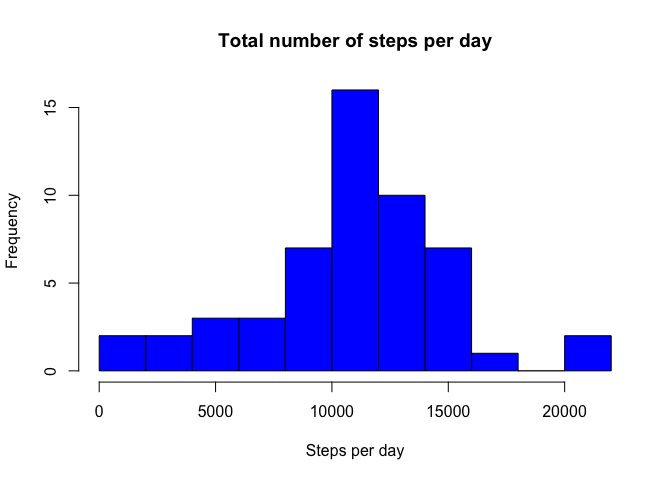
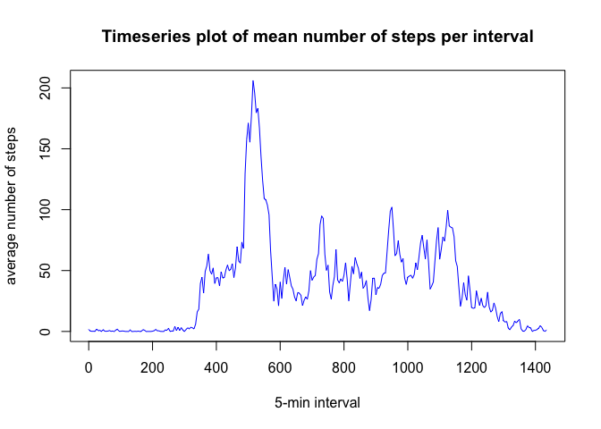
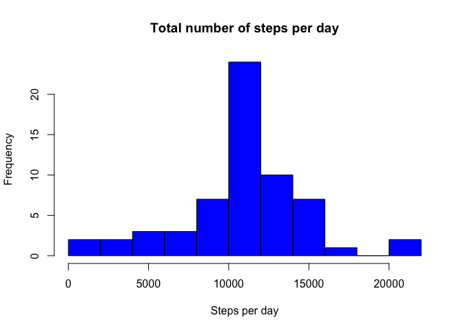
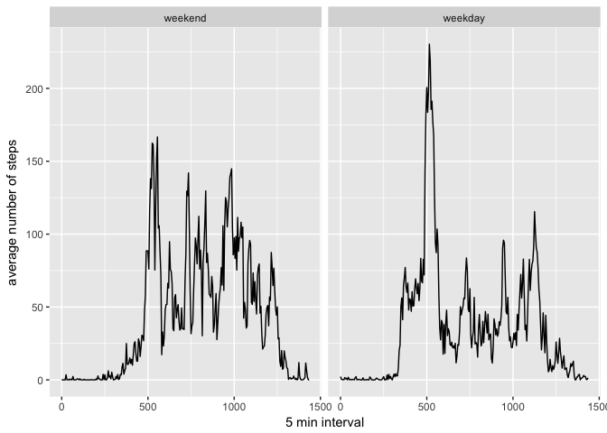

# Reproducible Research: Peer Assessment 1
Sholeh Yasini  
11 Jul 2017  


```r
library(ggplot2)
```

## Loading and preprocessing the data


```r
activity <- unzip("activity.zip")
activity_data <- read.csv("activity.csv", sep = ",")
activity_data$date <- as.Date(activity_data$date)
file.remove("activity.csv")
```

```
## [1] TRUE
```


## What is mean total number of steps taken per day?

1. Histogram of total number of steps per day


```r
# sum the number of steps per day
sumDay <- aggregate(steps ~ date, data = activity_data, FUN = sum) 
# plot the histogram
hist(sumDay$steps, breaks = 10, col = "blue",
     main = "Total number of steps per day",
     xlab = "Steps per day")
```

<!-- -->

2. The **mean** and **median** of the total number of steps taken each day:


```r
mean(sumDay$steps, na.rm = TRUE)
```

```
## [1] 10766.19
```

```r
median(sumDay$steps, na.rm = TRUE)
```

```
## [1] 10765
```


## What is the average daily activity pattern?

1. Time series plot of 5 minutes interval and the average number of steps 


```r
minute <- activity_data$interval %% 100
hour <- activity_data$interval %/% 100
activity_data$newInt <- hour * 60 + minute

meanInt <- aggregate(steps ~ newInt, data = activity_data, FUN = "mean")

plot(meanInt$newInt, meanInt$steps, type = "l", col = "blue",
     xlab = "5-min interval", ylab = "average number of steps",
     main = "Timeseries plot of mean number of steps per interval")
```

<!-- -->


## Imputing missing values

1. Calulate and report the total numner of missing values:


```r
missingval <- sum(is.na(activity_data$steps))
```

The total number of missing values are 2304.

2. Devise a strategy for filling in all of the missing values in the dataset.


```r
newdata <- activity_data
for (i in 1:nrow(newdata)){
    if(is.na(newdata$steps[i])){
        newdata$steps[i] <- meanInt$steps[meanInt$newInt == newdata$newInt[i]]
    }
}

s <- sum(is.na(newdata$steps))
```
The total number of missing values of the number of steps in the new dataset is 0.

3. The new dataset with no missing value is called **newdata**.

4. Hsitogram of total number of steps taken each day


```r
newSumDay <- aggregate(steps ~ date, data = newdata, FUN = sum)

hist(newSumDay$steps, breaks = 10, col = "blue",
     main = "Total number of steps per day",
     xlab = "Steps per day")
```

<!-- -->

The mean and median of total number of steps per day


```r
mean(newSumDay$steps)
```

```
## [1] 10766.19
```

```r
median(newSumDay$steps)
```

```
## [1] 10766.19
```

While the mean is the same the median has a slight increase considering the missing values. The total number of steps increases around the mean value.  


## Are there differences in activity patterns between weekdays and weekends?


```r
dates <- as.POSIXct(newdata$date)
weekday <- c("Monday","Tuesday","Wednesday","Thursday","Friday")
newdata$weekday <- factor(weekdays(dates) %in% weekday, levels = c(FALSE, TRUE), labels = c("weekend","weekday"))

g <- ggplot(data = newdata, aes(x = newInt, y = steps)) + 
    stat_summary(fun.y = mean, geom = "line") + 
    facet_grid(. ~ weekday) + labs(x = "5 min interval", y = "average number of steps")
g
```

<!-- -->

Higher number of steps at weekends than weekdays except for the morning hours which there is a spike in weekdays.

